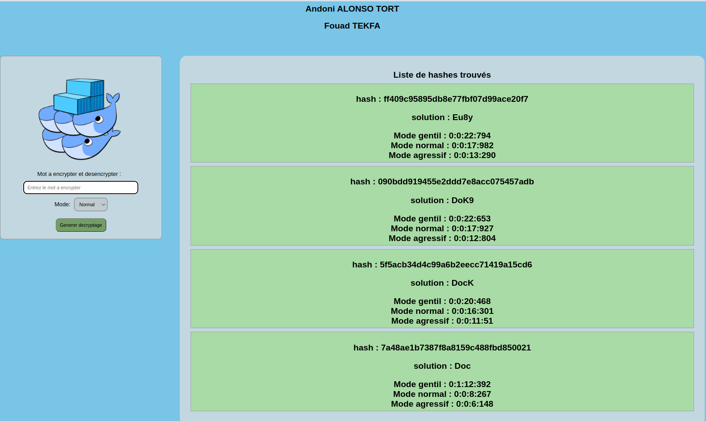

<div style="text-align:center; display:inline-flex;  flex-direction: row; background:#c1c1c187; width:100%">
    </img>
    <div>
        <h1>Docker Swarm</h1>
        <div>
            <h5>
                Andoni ALONSO TORT<br/>
                Fouad TEKFA
            </h5>
            <h5>UNIVERSITE DU HAVRE</h5>
        </div>    
    </div>
</div>

Pour ce TP on a utilisé docker Swarm.

Swarm fournit de nombreux outils pour faire évoluer, mettre en réseau, sécuriser et maintenir vos applications conteneurisées, au-delà des capacités des conteneurs eux-mêmes.

Pour pouvoir utilise docker swarm à dans notre application il a fallu installer docker dans notre image à l'intérieur de notre Dockerfile.

Le bout de ce projet est de décrypter un mot de passe donné par un utilisater avec un mode de recherche.

- Gentil
- Normal
- Agressif

Ces informations seront envoyées au serveur et il s'occupera de initialiser docker swarm avec les 'slaves' correspondants pour chaque mode de recherche en faissant aussi la scalabilité propre à chaque mode.

<table style="width:100%; background:#d3d3d3">
    <tbody style=" display:table; width: 100%;">
        <tr>
            <th style="background-color:lightblue;">Details</th>
            <th style="background-color:lightblue;">Gentil</th>
            <th style="background-color:lightblue;">Normal</th>
            <th style="background-color:lightblue;">Agressif</th>
        </tr>
        <tr>
            <th>Temps de mise à jour</th>
            <th>15000 ms</th>
            <th>10000 ms</th>
            <th>5000 ms</th>
        </tr>
        <tr>
            <th>Slaves scale</th>
            <th>2</th>
            <th>3</th>
            <th>4</th>
        </tr>
    </tbody>
</table>


Une fois le HASH décrypté, il sera sauvegaré dans la base de données (MONGODB) avec la structure suivante :
```js
HASH : {
    hash : HASH (encryptage du mot recherché)
    solution : Mot trouvé après de décryptage du hash
    details: {
        mode : Mode recherché (gentil, normal, agressig)
        time : Le temps qui a pris pour déchifrer le HASH
        date: La date quand il a été décrypté
    }
}
```

Pour les slaves on utilise l'image donnée en TP : servuc/hash_extractor et on communique avec WebSocket.

Pour le client, il utilise des rêquetes HTTP pour obtenir les informations des HASH et envoyer une nouvelle demande de décryptage.

<b>ATTENTION :</b> Les mots de passe supérieurs à 4 caracteres peuvent prendre beaucoup de temps à décrypter ou pourraient entraîner des problèmes dans la performance du code.

# Execution de l'application

Pour éxecuter il suffir d'utiliser la commande suivante : 
> docker compose up

Attendes que l'application soit lancée et maintenant vous pouvez aller sur votre navigateur : http://localhost:3000



Ici vous pouvez taper un mot pour l'encrypter, puis chercher la solution. 
L'hitorique sera affiche du côté droit avec le mode et le temps d'éxecution de chaque mot.

Pour arreter tous les conteneurs : 
> docker compose down